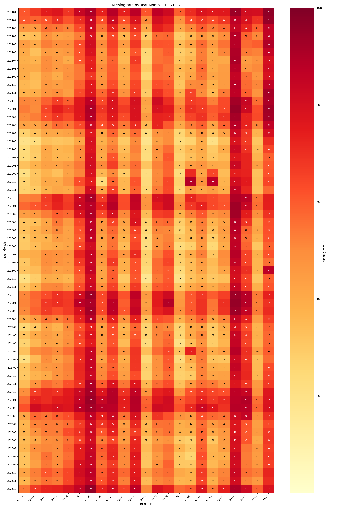
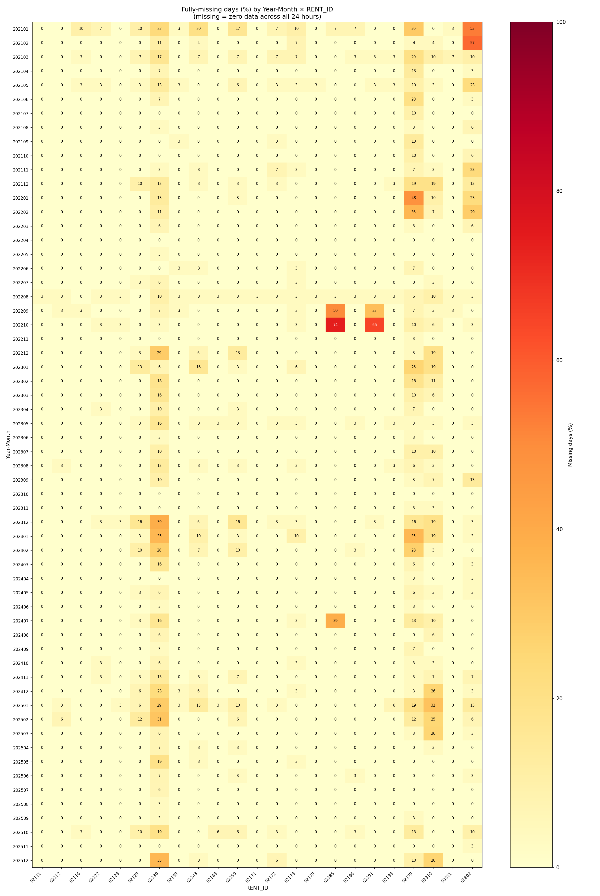

# 따릉이 대여 데이터 결측치 분석 보고서

- **분석 대상**: 서울 공공자전거(따릉이) 대여 이력 (2021.01 ~ 2025.12)
- **분석 정류소**: target_rent_id.txt 내 23개 정류소
- **분석 기준**: 연월(Year-Month) × 정류소번호(RENT_ID) 단위 결측률

---

## 1. 결측치 판단 기준 변경

### 기존 기준 — 시간 단위 결측
초기에는 분석 대상 전 기간의 (날짜 × 시간 × 정류소) 조합을 전수 생성하여,
해당 조합에 데이터가 존재하지 않으면 모두 결측으로 판단하였다.

| 항목 | 값 |
|---|---|
| 기대 조합 수 | 1,000,224건 |
| 결측으로 판정된 조합 수 | 561,203건 |
| 결측률 | **56.1%** |

그러나 이 기준에는 구조적인 문제가 있다.
**심야·새벽 시간대처럼 이용 자체가 없는 시간은 데이터가 0건으로 집계되어 원본 CSV에 행이 생성되지 않는다.**
즉, 실제 이용이 없어서 행이 없는 경우와 수집 오류로 누락된 경우를 구분할 수 없으며,
이용이 적은 시간대의 정상 데이터가 대부분 결측으로 오분류된다.

### 변경된 기준 — 하루 전체 결측
> **특정 날짜에 해당 정류소의 24시간 전 시간대에 걸쳐 데이터가 단 한 건도 존재하지 않을 경우에만 결측으로 판정한다.**

이 기준은 다음 논리에 근거한다.

- 운영 중인 정류소라면 하루 중 어느 한 시간대에라도 이용 기록이 남을 가능성이 매우 높다.
- 반대로 하루 전체에 걸쳐 이용 기록이 없다면, 데이터 수집 실패 또는 정류소 비운영으로 판단하는 것이 타당하다.

| 항목 | 값 |
|---|---|
| 기대 조합 수 (날짜 × 정류소) | 41,676건 |
| 결측으로 판정된 조합 수 | 881건 |
| 결측률 | **2.1%** |

기준 변경 후 결측률이 56.1% → **2.1%** 로 크게 감소하였다.
기존의 54%p 이상은 이용 건수가 0인 정상 데이터였음을 확인할 수 있다.

---

## 2. 결측치 시각화 분석

### 2-1. 기존 기준 히트맵 (시간 단위 결측)



**[그림 1] Missing rate by Year-Month × RENT_ID (기존 기준)**

- **전체적으로 짙은 적색**이 지배적으로, 대부분의 (연월, 정류소) 조합에서 결측률이 40~100%로 나타난다.
- 이는 앞서 설명한 바와 같이 **이용 건수 0인 정상 시간대가 결측으로 오분류**되어 발생한 결과이다.
- 일부 연월에서 상대적으로 밝은(낮은) 셀이 관찰되는데, 이는 해당 기간에 이용이 활발하여 시간대별 데이터가 많이 채워진 것으로 해석된다. (예: 여름철 성수기)
- 이 기준으로는 결측의 패턴이나 특이 정류소를 식별하기 어렵고, 분석에 활용하기 부적절하다.

---

### 2-2. 변경된 기준 히트맵 (하루 전체 결측)



**[그림 2] Fully-missing days (%) by Year-Month × RENT_ID (변경된 기준)**

- 대부분의 셀이 **연한 노란색(0~5%)** 으로, 전반적으로 결측이 낮음을 보여준다.
- 결측이 집중된 특이 구간이 명확히 식별된다.

**주요 결측 패턴:**

| 정류소 | 결측률 | 최장 연속 결측 | 주요 결측 시기 |
|---|---|---|---|
| 02130 | 10.7% | 5일 | 다수 월에 산발적 |
| 02199 | 9.3% | 17일 | 특정 월 집중 |
| 03310 | 6.1% | 4일 | 2024년 전후 |
| 03802 | 5.6% | 13일 | 특정 월 집중 |
| 02185 | 2.9% | **36일** | 장기 연속 결측 |

- **02185** 정류소는 결측률 자체는 낮으나 최대 36일 연속 결측이 발생하였다. 이는 단순 오류가 아닌 정류소 일시 폐쇄·이전 가능성을 시사한다.
- **02199, 03802** 정류소는 특정 시기에 집중적으로 결측이 발생하여, 해당 기간 데이터 수집 장애가 있었을 가능성이 있다.
- **2021년 초, 2022년 10월, 2023년 12월, 2025년 1월** 등 여러 정류소에 동시에 결측이 발생한 시점은 시스템 전체 수집 오류였을 가능성이 있다.

---

## 3. 결측치 보정 방안

결측의 성격(단기 산발적 vs. 장기 연속)에 따라 보정 전략을 다르게 적용하는 것이 바람직하다.

### 3-1. 단기 결측 (1~3일) — 선형 보간 또는 인접일 평균

이용 패턴의 연속성이 유지되는 단기 결측에는 선형 보간이 자연스럽다.

```python
# 예시: 정류소별, 시간대별로 선형 보간
df_pivot = df.pivot_table(index='RENT_DATE', columns=['RENT_ID', 'RENT_TIME'], values='CNT')
df_pivot = df_pivot.interpolate(method='linear', limit=3, limit_direction='both')
```

### 3-2. 중기 결측 (4~14일) — 동일 요일·시간 평균으로 대체

이용량은 요일 패턴이 강하므로, 결측 전후 동일 요일의 값으로 대체하는 것이 효과적이다.

```python
# 결측 날짜의 요일(DOW)과 시간대(RENT_TIME)가 같은 주변 날짜의 평균으로 대체
df['DOW'] = pd.to_datetime(df['RENT_DATE'], format='%Y%m%d').dt.dayofweek
dow_hour_mean = df.groupby(['RENT_ID', 'DOW', 'RENT_TIME'])['CNT'].mean()
# 결측 행에 해당 평균값을 채움
```

### 3-3. 장기 결측 (15일 이상) — 결측 플래그 처리 후 모델에서 제외

02185(최대 36일), 02199(최대 17일), 03802(최대 13일)처럼 장기 연속 결측은 보간으로 채우면 오히려 모델을 왜곡할 수 있다.

- 해당 구간은 `CNT = NaN` 상태를 유지하되, **is_missing 플래그 컬럼**을 추가하여 모델이 결측 여부를 인식할 수 있게 한다.
- 시계열 예측 모델 학습 시 해당 기간을 **학습 윈도우에서 제외**하거나, 마스킹 처리하는 것이 권장된다.

### 3-4. 정류소 비운영 기간 처리

02185처럼 장기 결측이 운영 중단에 기인한 경우, 해당 기간을 **0으로 채우는 것이 보간보다 더 현실에 가깝다.**
서울시 공공자전거 운영 이력 데이터와 교차 검증하여 비운영 구간을 확정한 뒤 0으로 처리하는 것을 권장한다.

---

## 4. 요약

| 항목 | 기존 기준 (시간 단위) | 변경된 기준 (하루 전체) |
|---|---|---|
| 결측 판정 기준 | (날짜, 시간, 정류소) 조합 부재 | (날짜, 정류소) 전 시간대 부재 |
| 전체 결측률 | 56.1% | **2.1%** |
| 실질 활용 가능성 | 낮음 (오분류 다수) | 높음 |
| 주요 결측 정류소 | 식별 불가 | 02130, 02199, 03310, 03802, 02185 |
| 권장 보정 방법 | — | 기간별 차등 적용 (보간·요일 평균·제외) |

기존 기준의 결측 56.1% 중 **대부분은 이용 건수 0인 정상 데이터**였으며,
변경된 기준에 의한 **실질 결측률은 2.1%** 로 분석에 충분히 활용 가능한 수준이다.
단, 결측 기간의 길이에 따라 보정 전략을 달리 적용하여 모델 왜곡을 최소화해야 한다.
